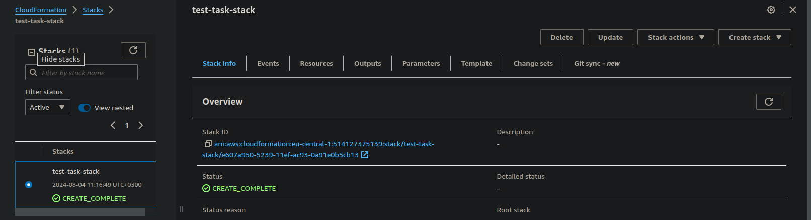

## Prerequisites:
1. Build lambda with dependencies - dependencies should be available as lambda layer, layer should be uploaded and available on s3

## Usage:
1. Create S3 bucket (to upload lambda layer) before using cloudformation template, reference bucket name in the template

1. `aws cloudformation create-stack --stack-name MyStack --template-body file://template.yaml --capabilities CAPABILITY_NAMED_IAM` should return response like:
```
{
    "StackId": "arn:aws:cloudformation:eu-central-1:514127375139:stack/test-task-stack/e607a950-5239-11ef-ac93-0a91e0b5cb13"
}
```

1. Wait until template has created resources 

### Bucket policy example for public access:
```
{
    "Version": "2012-10-17",
    "Statement": [
        {
            "Sid": "Statement1",
            "Effect": "Allow",
            "Principal": "*",
            "Action": "s3:GetObject",
            "Resource": "arn:aws:s3:::chi-test-task-bucket/*"
        }
    ]
}
```


### Potential issues:
1. Bucket name is not unique (s3 is global service, fyi)
1. To make the image public - uncheck 'block all access' and create a bucket policy (see example)
1. ``` 
MyLambdaFunction:
    Type: 'AWS::Lambda::Function'
    Properties:
      FunctionName: MyLambdaFunction
      Handler: lambda_function.lambda_handler
```
where `Handler: lambda_function.lambda_handler` needs to match the name where the function is saved, and the name of the function itself